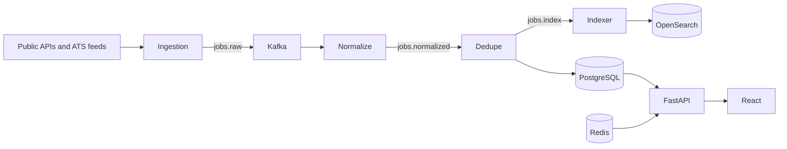

# Architecture

Job Pull keeps PostgreSQL as the canonical application database. OpenSearch is a derived search index, Redis is a cache/rate-limit store, Kafka transports durable events, and Airflow orchestrates scheduled source runs. The initial API and web UI are deliberately usable in `DEMO_MODE`; persistence-backed repositories, authentication, CV parsing, and workers are the next phases rather than simulated features.

## Event topics

`jobs.raw`, `jobs.normalized`, `jobs.deduplicated`, `jobs.updated`, `jobs.deleted`, `jobs.index`, `jobs.dead_letter`, `cv.uploaded`, `cv.parsed`, `matching.requested`, `matching.completed`, and `notifications.created` are reserved topic names. Consumers must attach an event ID and be idempotent.

## Adding a source

Create a connector implementing `JobSourceConnector`, configure its credentials and rate limit through environment/configuration, register it in the ingestion worker, and add connector plus normalization tests. Only add sources with a permitted public API, ATS endpoint, or feed.
